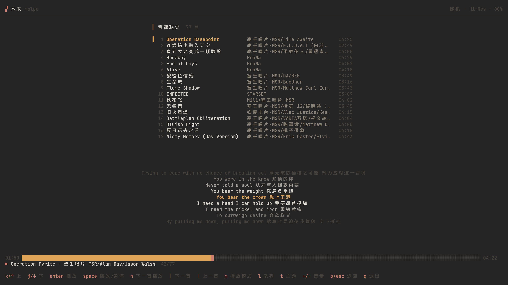

# 木末 Molpe

Linux 终端里的极简网易云音乐播放器。

功能克制、界面干净、跑起来不怎么吃电（大概。适合想在超轻本上一边苦逼当牛马一边听歌、又不想为此多背半首歌续航的人。



## 定位

- **极简**：只做登录、歌单、播放、队列这几件事，不试图复刻一个完整的网易云客户端（~~也复刻不动~~
- **轻量低功耗**：Go 单体程序 + mpv 解码，后台定时器全部按需唤醒——歌词在下一句到来前才醒一次，进度条暂停即停，不动的时候是真的不动。给超轻本的续航添砖加瓦（微小
- **队列逻辑花了心思**：历史严格按实际播放顺序记录、随机播放是每次都重新roll的真随机（不是把队列打乱一次然后循环播放那种"伪随机"），还带回避窗口不会刚听过又来一遍、"下一首播放"永远最高优先级、队列快照落盘、退出后重进恢复待播……用过一些播放器之后觉得这块值得认真做，于是认真做了。当然，逻辑是否符合每个人的直觉就不敢保证了（~~起码符合我自己的~~
- **仅适配 Linux 下的现代终端**：目前只在 **Arch Linux + kitty** 上实测过，其他环境的兼容性属于缘分

## 功能

- 终端二维码登录网易云账号（Cookie 本地持久化）
- 浏览自己创建与收藏的歌单
- 播放 / 暂停 / 上一首 / 下一首，顺序、列表循环、随机三种模式
- "下一首播放"队列，指定的歌拥有最高优先级
- Hi-Res 音质支持（走 EAPI，等级与实际文件一致）
- 滚动歌词（可带翻译）与自适应进度条
- 通过 MPRIS 接入桌面环境：KDE 媒体组件、媒体键均可控制
- 内置双主题，支持自定义配色（`~/.config/molpe/themes/*.json`）

## 安装

### AUR（推荐）

```sh
paru -S molpe-bin
```

预编译包，装完直接 `molpe` 启动。运行时依赖 `mpv`。

### 从源码构建

```sh
git clone https://github.com/Nk-YMZ/Molpe.git
cd Molpe
go build -o molpe .
```

需要 Go ≥ 1.27 与 mpv。

## 快捷键

| 按键 | 作用 |
| --- | --- |
| `j` / `k` / `↑` / `↓` | 移动光标 |
| `enter` | 进入歌单 / 播放歌曲 |
| `space` | 播放 / 暂停 |
| `]` / `[` | 下一首 / 上一首 |
| `n` | 加入"下一首播放" |
| `m` | 切换播放模式 |
| `l` | 播放队列弹窗 |
| `t` | 主题选择 |
| `+` / `-` | 音量 |
| `b` / `esc` | 返回 |
| `q` | 退出 |

## 配置

首次运行会在 `~/.config/molpe/config.json` 生成带说明的完整模板，主要包括：

- `quality`：音质（`standard` / `higher` / `exhigh` / `lossless` / `hires`）
- `lyric_lines`、`lyric_translation`：歌词行数与翻译开关
- `random_no_repeat`：随机播放回避最近 N 首
- `song_gap`：相邻两曲之间的静默间隔
- `theme`：主题名

改完重启生效。

## TODO

- [ ] 更多播放队列模式，以及对现有队列逻辑的持续打磨
- [ ] 多歌单拼接播放
- [ ] 更多自定义配置项

## 致谢

- [go-musicfox](https://github.com/go-musicfox/go-musicfox)：本项目的灵感来源，其 Go 版网易云 API 封装（[netease-music](https://github.com/go-musicfox/netease-music)）让这一切成为可能
- Kimi：感谢奋笔疾书，本项目的大量代码出自其手（~~作者主要负责提需求和验收~~

## License

MIT
